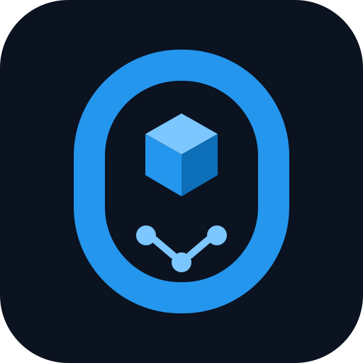

<p align="center">
  
</p>

# docker-zero

**Mock Docker Engine for deterministic Docker API, Docker Compose, container orchestration, network, port, DNS, Redis, Nginx, and fault-injection testing without running real containers.**

[](https://github.com/vas1le/docker-zero/actions/workflows/ci.yml)
[](https://github.com/vas1le/docker-zero/actions/workflows/codeql.yml)
[](LICENSE)
[](go.mod)

`docker-zero` is a stateful test double for the Docker Engine API. It exposes Docker-compatible HTTP endpoints over a Unix socket and emulates containers, images, networks, volumes, published ports, service discovery, health state, and selected service protocols in memory.

It is intended for testing software that controls Docker: orchestrators, deployment agents, CI/CD tooling, operators, installers, platform services, and failure-recovery logic.

It does **not** create real containers, namespaces, cgroups, image layers, or container processes.

## Why

A real orchestration test can spend most of its time pulling images, starting services, waiting for health checks, and cleaning up infrastructure. That makes failure-path testing slow and expensive.

`docker-zero` keeps the Docker client side real while replacing the daemon and workloads with deterministic state machines:

```text
Docker CLI / Docker Compose / SDK / orchestrator
                       |
                       | Docker Engine HTTP API
                       v
                 docker-zero.sock
                       |
        +--------------+---------------+
        |              |               |
   container state   networks        ports
        |              |               |
        +------- service emulators -----+
                 Nginx / Redis
```

The system under test can continue using `DOCKER_HOST` and the normal Docker API surface.

## Main capabilities

- Docker Engine API mock over a Unix socket.
- Real Docker Compose client compatibility for the tested API surface.
- Stateful container create, inspect, start, stop, pause, unpause, restart, remove, and health behavior.
- Images, networks, volumes, labels, and Compose resource discovery.
- Per-container virtual IP allocation and network-scoped service aliases.
- Fixed and ephemeral host-port publishing with real collision detection.
- Multiple replicas with independent IPs, runtime state, and service state.
- Active-endpoint protection when deleting networks.
- Nginx HTTP service emulation.
- Redis RESP2 service emulation and behavioral master/replica state.
- Deterministic failure scenarios through service cookbooks.
- Ordered JSONL ledgers for Docker calls, service requests, and state transitions.
- Explicit unsupported-operation reporting instead of silently pretending an API exists.

## Quick start

Build:

```bash
git clone https://github.com/vas1le/docker-zero.git
cd docker-zero
make build
```

Start the healthy baseline in one terminal (no root privileges or real Docker
daemon required):

```bash
./dist/docker-zero-linux-amd64 \
  --socket /tmp/docker-zero.sock \
  --seed 0 \
  --container-endpoints off \
  --ledger-dir ./runs
```

In another terminal, from this repository directory, use the real Docker CLI
with its Compose plugin. The included `compose.yaml` starts the simulated Nginx
and Redis models and binds their published ports to localhost only:

```bash
DOCKER_HOST=unix:///tmp/docker-zero.sock docker compose -f compose.yaml up -d
DOCKER_HOST=unix:///tmp/docker-zero.sock docker compose -f compose.yaml ps
curl http://127.0.0.1:18080/health
```

Clean up the demo before stopping the simulator with Ctrl+C:

```bash
DOCKER_HOST=unix:///tmp/docker-zero.sock docker compose -f compose.yaml down
```

These process-scoped assignments do not redirect subsequent Docker commands in
your shell. Set `DOCKER_ZERO_HTTP_PORT` / `DOCKER_ZERO_REDIS_PORT` for alternative
published ports; pass those same values to each Compose command. To test without
any Docker client, run `make doctor` instead.

Compose itself is not reimplemented. The real client parses the included file
and calls the simulated Engine API. This tests container-control logic and
fixture protocols, **not the real image's application behavior**. The demo uses
restart policy `no`, so a crashed service needs an explicit recovery action.

See [configuration limits and strict mode](docs/configuration-contract.md),
[exec fixtures](docs/exec-fixtures.md), [image mappings](docs/image-mappings.md),
and [restart-policy semantics](docs/restart-policy.md). Custom healthcheck
commands and arbitrary processes are not executed; unmodeled behavior is never
silently counted as a successful strict matrix test.

`--container-endpoints auto` is the default. In this mode docker-zero attempts direct virtual container-IP listeners where the host permits them and still provides published-port listeners. `--container-endpoints on` is strict: if a virtual endpoint cannot bind, startup fails. On Linux, strict emulation of container ports below 1024 requires the host to allow unprivileged low-port binding or the process to have the corresponding privilege/capability.

## Scenarios

Cookbooks live under `cookbooks/` and define deterministic behavior for a service type.

The shipped convention is:

```text
seed 0 = healthy baseline
seed 1 = transient failure / recovery
seed 2 = crash / restart path (automatic recovery requires a restart policy)
```

Run one global scenario:

```bash
./dist/docker-zero-linux-amd64 --seed 2
```

Override a specific service or container:

```bash
./dist/docker-zero-linux-amd64 \
  --seed 0 \
  --scenario nginx=2,redis-zero=1
```

## Validation

Configuration check:

```bash
./dist/docker-zero-linux-amd64 --check --cookbook-dir ./cookbooks
```

Core tests and quality gates:

```bash
make verify
```

`make verify` includes formatting, pinned `golangci-lint`, unit tests, the race detector, `go vet`, Python syntax checks, Docker API integration, doctor checks, and the orchestration matrix harness.

Compose compatibility:

```bash
COMPOSE_BIN="docker compose" make compose-topology
```

Extended local stress pass:

```bash
make retest
```

## Development quality gates

The repository uses:

- `gofmt` and `go vet`;
- `golangci-lint` v2;
- Go race detector;
- Go fuzz tests;
- `govulncheck`;
- CodeQL;
- Dependabot for Go modules and GitHub Actions;
- `pre-commit` hooks for contributor-side checks;
- GitHub Actions for tests, Compose compatibility, cross-architecture builds, and releases.

Install local hooks:

```bash
python3 -m pip install pre-commit
pre-commit install
```

## Versioning and releases

The project uses semantic versioning.

`VERSION` contains the source release version. Release tags use the same value with a `v` prefix:

```text
VERSION: 0.4.2
tag:     v0.4.2
```

The release workflow rejects a tag that does not match `VERSION`, then runs validation and builds static Linux `amd64` and `arm64` binaries with SHA-256 checksums.

## Current scope

`docker-zero` is not a general-purpose container runtime and does not aim to implement every Docker feature.

Not implemented as real kernel/runtime features:

- namespaces and cgroups;
- image filesystem execution;
- process execution inside containers;
- a real Docker embedded DNS server at `127.0.0.11`;
- Redis persistence or Redis wire-level replication;
- Docker event streaming (`GET /events`);
- Docker disk-usage accounting (`GET /system/df`);
- arbitrary Engine endpoints not required by a tested client or compatibility case.

When a Docker API operation is unsupported, the mock reports it explicitly with `X-Docker-Zero-Unsupported: true` and records the request in the ledger.

## Open source

`docker-zero` is intended to be a reusable open-source test tool. Fork it, modify it, embed it in test infrastructure, add protocol emulators, or use it in commercial and non-commercial projects under the MIT License.

## Contributing

Contributions are welcome. See [CONTRIBUTING.md](CONTRIBUTING.md).

Good contribution areas include Docker API compatibility, additional deterministic failure modes, new service emulators, Compose behavior, fuzzing, and regression tests based on real orchestration failures.

## License

MIT. See [LICENSE](LICENSE). You can use, modify, redistribute, and include `docker-zero` in commercial or non-commercial projects under the license terms.

## Search terms

Docker mock, mock Docker Engine, fake Docker daemon, Docker API emulator, Docker Compose mock, container runtime simulator, Docker testing, orchestrator testing, container orchestration testing, fault injection, Docker network mock, Docker DNS mock, Redis mock, Nginx mock, integration testing, DevOps testing, DevSecOps testing.
